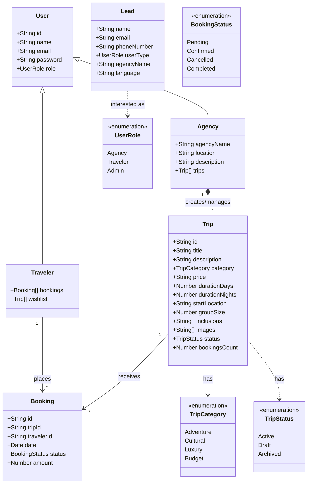

# Project Class Diagram

This diagram represents the domain entities and their relationships based on the current codebase structure (Agency, Traveler, Landing apps).

```mermaid
classDiagram
    %% Users & Actors
    class User {
        +String id
        +String name
        +String email
        +String password
        +UserRole role
    }

    class Agency {
        +String agencyName
        +String location
        +String description
        +Trip[] trips
    }

    class Traveler {
        +Booking[] bookings
        +Trip[] wishlist
    }

    %% Core Entities
    class Trip {
        +String id
        +String title
        +String description
        +TripCategory category
        +String price
        +Number durationDays
        +Number durationNights
        +String startLocation
        +Number groupSize
        +String[] inclusions
        +String[] images
        +TripStatus status
        +Number bookingsCount
    }

    class Booking {
        +String id
        +String tripId
        +String travelerId
        +Date date
        +BookingStatus status
        +Number amount
    }

    %% Marketing / Landing (Leads)
    class Lead {
        +String name
        +String email
        +String phoneNumber
        +UserRole userType
        +String agencyName
        +String language
    }

    %% Enumerations
    class TripCategory {
        <<enumeration>>
        Adventure
        Cultural
        Luxury
        Budget
    }

    class TripStatus {
        <<enumeration>>
        Active
        Draft
        Archived
    }

    class UserRole {
        <<enumeration>>
        Agency
        Traveler
        Admin
    }

    class BookingStatus {
        <<enumeration>>
        Pending
        Confirmed
        Cancelled
        Completed
    }

    %% Relationships
    User <|-- Agency
    User <|-- Traveler
    
    Agency "1" *-- "*" Trip : creates/manages
    
    Traveler "1" --> "*" Booking : places
    Trip "1" --> "*" Booking : receives
    
    Trip ..> TripCategory : has
    Trip ..> TripStatus : has
    
    Lead ..> UserRole : interested as
```
